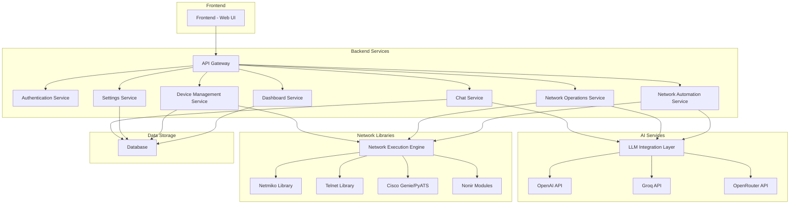

# Application Architecture
## Network Automation Platform with GENAI

### 1. High-Level Architecture

### 2. Component Descriptions

#### 2.1 Frontend (Web UI)
- Built with modern web technologies (React/Vue.js or similar)
- Six distinct pages as per requirements
- Responsive design for various devices
- Real-time updates through WebSocket connections where needed

#### 2.2 API Gateway
- Central entry point for all client requests
- Routes requests to appropriate backend services
- Handles authentication and authorization
- Implements rate limiting and security measures

#### 2.3 Authentication Service
- User authentication and session management
- API key validation for external integrations
- Role-based access control

#### 2.4 Dashboard Service
- Provides system overview and metrics
- Aggregates data from other services
- Manages user notifications and alerts

#### 2.5 Network Automation Service
- Configuration generation using GENAI
- Validation and cleaning of configurations
- Deployment orchestration
- Confirmation and rollback mechanisms

#### 2.6 Network Operations Service
- Audit functionality
- Troubleshooting assistance
- Baseline creation and comparison
- Performance analysis tools

#### 2.7 Device Management Service
- CRUD operations for network devices
- Device polling and status monitoring
- Ping testing capabilities
- Device inventory management

#### 2.8 Settings Service
- LLM provider selection and configuration
- API key management
- Chat settings configuration
- User preferences storage

#### 2.9 Chat Service
- Agentic AI interactions
- RAG implementation
- Conversation history management
- Context preservation

#### 2.10 LLM Integration Layer
- Abstraction layer for multiple LLM providers
- Provider switching capabilities
- Rate limiting and error handling
- Response caching for performance

#### 2.11 Network Execution Engine
- Core engine for network operations
- SSH/Telnet connection management
- Configuration deployment and retrieval
- Device interaction orchestration

#### 2.12 Data Storage
- Database for persistent data storage
- Device information
- User settings and preferences
- Chat history and conversation context
- Audit logs and operation history

### 3. Technology Stack

#### 3.1 Frontend
- Framework: React/Vue.js with TypeScript
- State Management: Redux/Vuex or similar
- UI Components: Material-UI/Ant Design or similar
- Build Tool: Webpack/Vite

#### 3.2 Backend
- Language: Python (for AI integration) with FastAPI
- API: RESTful APIs with JSON
- Authentication: JWT/OAuth2
- Database: PostgreSQL/MongoDB
- Task Queue: Celery/RQ for background jobs

#### 3.3 AI/ML Components
- LLM Frameworks: LangChain, CrewAI, LangGraph
- RAG: Custom implementation with vector databases
- Model APIs: OpenAI, Groq, OpenRouter

#### 3.4 Network Libraries
- Netmiko: For SSH connections
- Telnetlib: For Telnet connections
- Cisco Genie/PyATS: For parsing and testing
- Nonir: Additional network operations

#### 3.5 Infrastructure
- Containerization: Docker
- Orchestration: Docker Compose/Kubernetes
- Reverse Proxy: Nginx
- Monitoring: Prometheus/Grafana

### 4. Data Flow

1. User interacts with Web UI
2. UI sends requests to API Gateway
3. API Gateway routes to appropriate service
4. Service processes request and interacts with:
   - Database for persistent data
   - LLM Integration Layer for AI operations
   - Network Execution Engine for device interactions
5. Results are returned through the same path
6. UI updates to reflect results

### 5. Security Considerations

- All communications over HTTPS
- API keys encrypted at rest
- Device credentials securely stored
- Role-based access control
- Input validation and sanitization
- Regular security audits